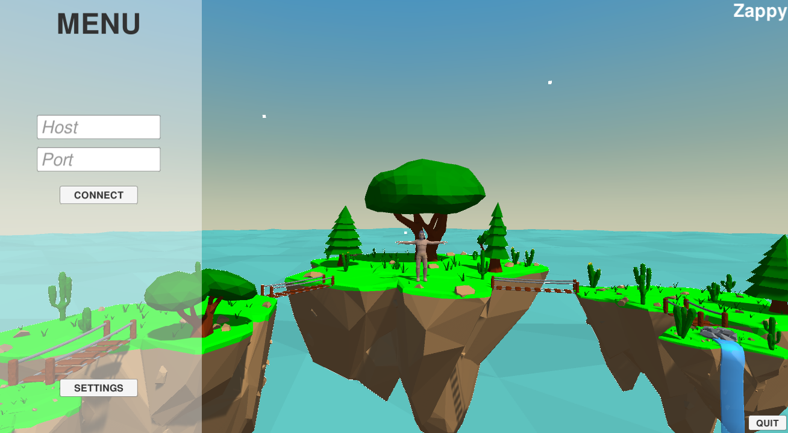
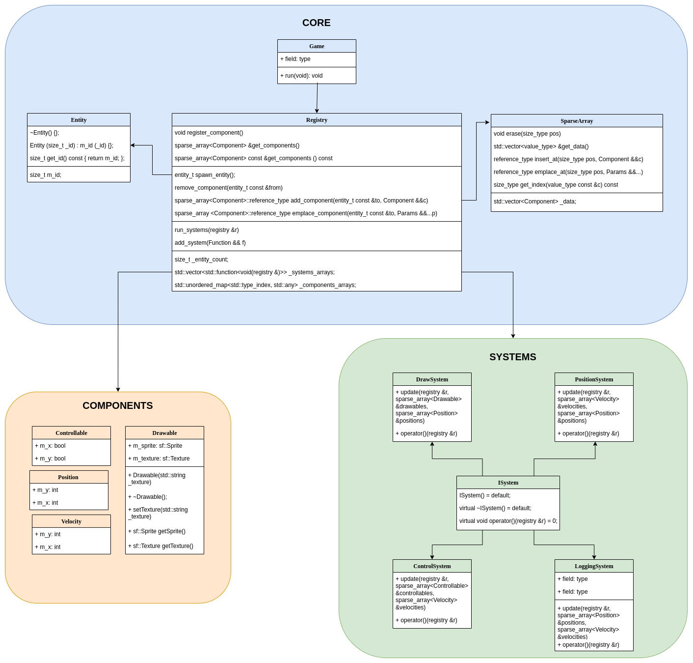

***********
Part 2: GUI
***********

Description
===========
To have a better vision of the game, which is simple, clear and ergonomic,
we made a user interface with the Unity engine.
We will describe below how our GUI works.

Main menu
=========
First of all, a main menu will appear.
To launch the game you just have to enter the ip of the server and its corresponding port.
In this menu, it is also possible to set the keys and the sensitivity.

.. code:: C#

    // Host field
    public void setHostText(string value) {
        host_text.GetComponent<UnityEngine.UI.InputField>().text = value;
        host = value;
    }
    // Port field
    public void setPortText(string value) {
        port_text.GetComponent<UnityEngine.UI.InputField>().text = value;
        port = value;
    }
    // Connect button
    public void click_connect() {
        string host = host_text.GetComponent<UnityEngine.UI.InputField>().text;
        string port = port_text.GetComponent<UnityEngine.UI.InputField>().text;

        connect_menu.GetComponent<Connect_menu>().setInfos(host, int.Parse(port));
        connect_menu.SetActive(true);
    }
    // Settings button
    public void click_settings() {
        host = host_text.GetComponent<UnityEngine.UI.InputField>().text;
        port = port_text.GetComponent<UnityEngine.UI.InputField>().text;
        instance.SetActive(false);
        leave_button.GetComponent<Leave_settings>().main = true;
        settings_menu.SetActive(true);
    }

Attempt server information
==========================
Here is the class diagram representing the architecture of our ECS showing the 3 main parts: the core, the components and the systems:

