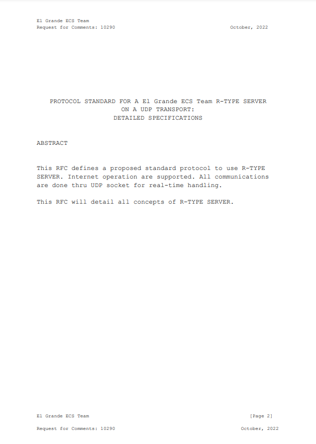
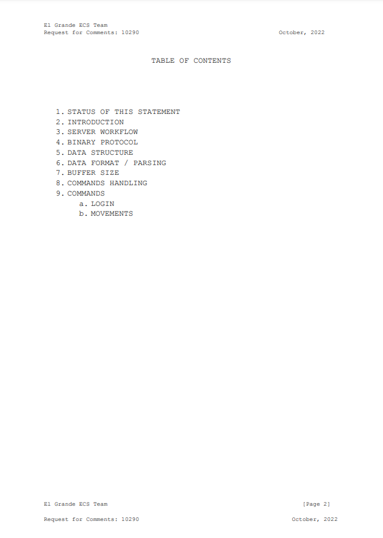
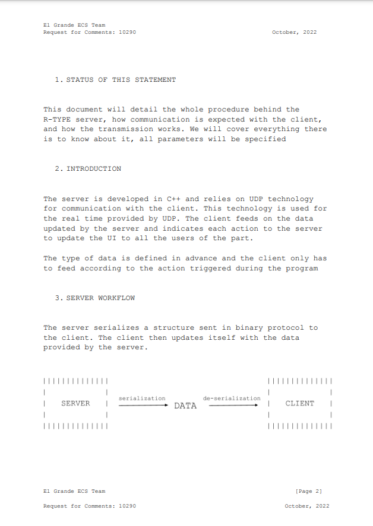
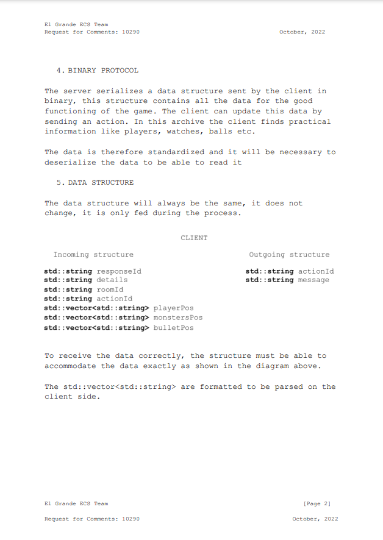
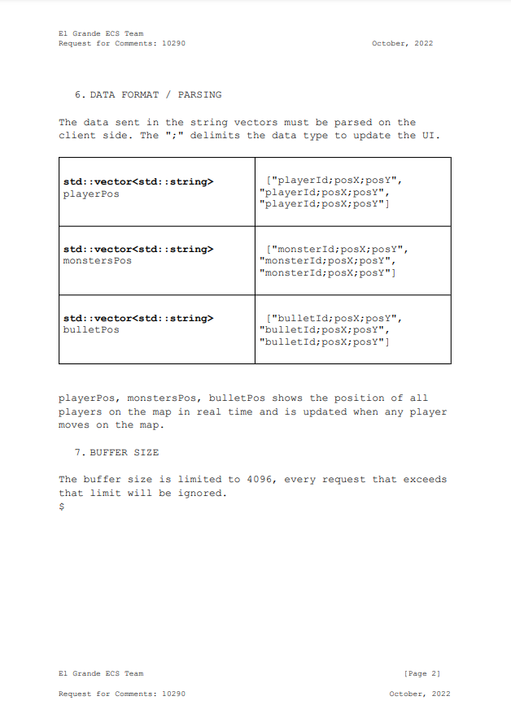
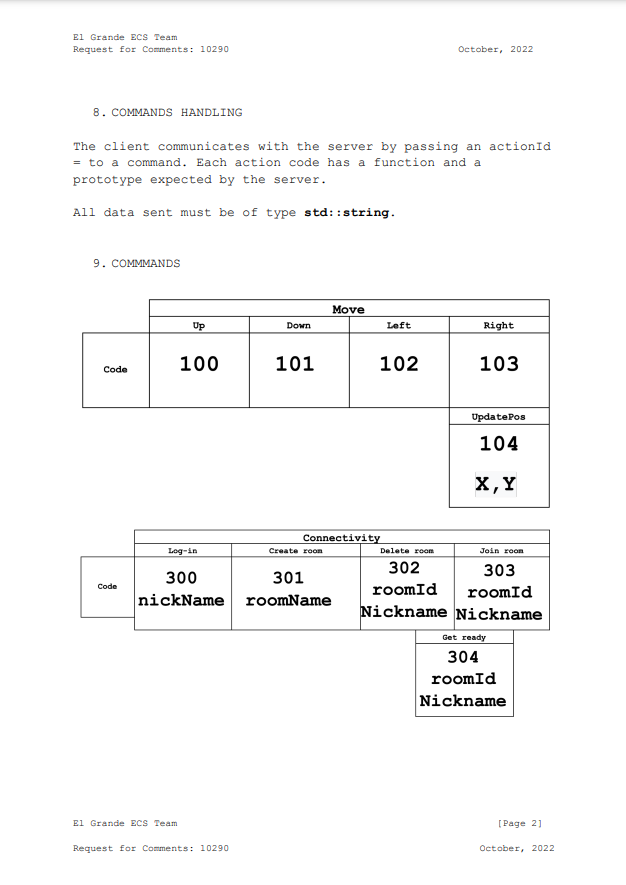
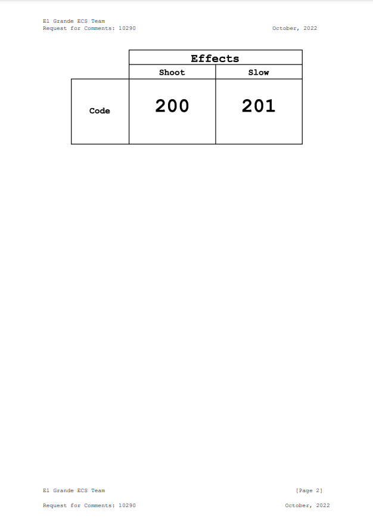

************
Protocol RFC
************

Description
===========
In order to better define the communication protocol,
we have made a summary table of the different commands used for the server transmission and the user interface reception.
A small description of each command is listed in the table and all parameters are defined in the index.

