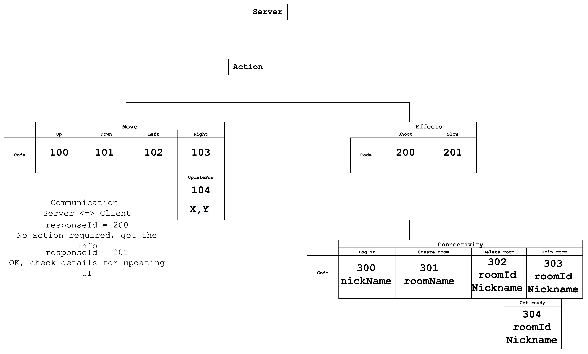

**************
Part 1: Server
**************

Description
===========
The server implements all the game logic. It acts as the authoritative source of game logic events in the
game.

Protocol diagram
================
The server is a TCP server that listens on port 12345. It accepts connections from clients.
All communication between the server and the clients is done using the protocol described below:

