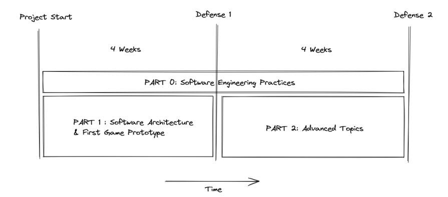

******
R-Type
******

Welcome to our R-Type documentation!
====================================

**R-Type** is the final project made in our second year in Epitech.
The goal of this project is to create a network game.
Several teams confront on a tiles map containing resources.
The winning team is the one with 6 players who reached maximum elevation.
The following documentation describe all the details and constraints.

Thus there is three parts to this project:

- **The server:** Resource service software that responds to UPD requests
- **The client:** Software designed to connect to a server via sockets
- **The Entity Component System:** Software architectural pattern who represent the game world object

Schema
======

--> Represents the roadmap of the project during 8 weeks.

Information
===========

.. note::

   We are a team of 5 students on this project.
   To divide the work, 2 people are in charge of the ECS, 2 others for the server/client protocol and the last one for the integration, compilation and documentation

.. warning::

   This project requires a lot of work during 8 weeks.
   Time management must be well thought out in order to complete this project on time!

Contents
========
.. toctree::
   Usage
   Protocol
   Server
   Client
   ECS
